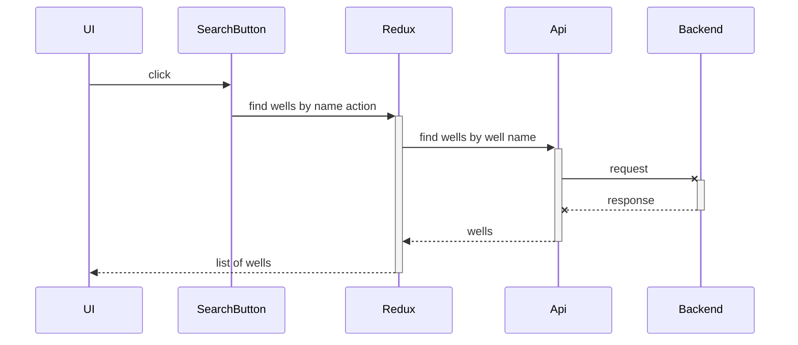
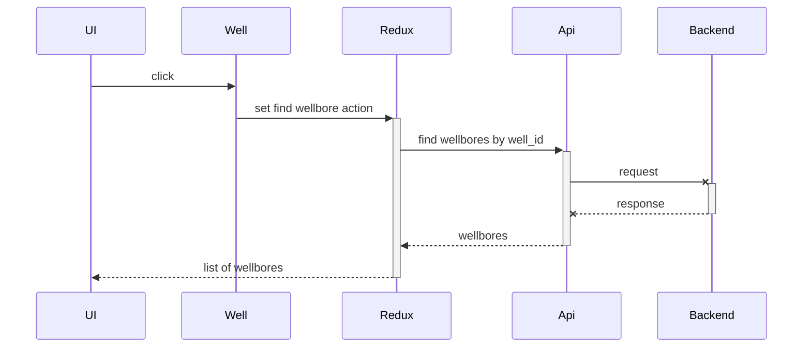
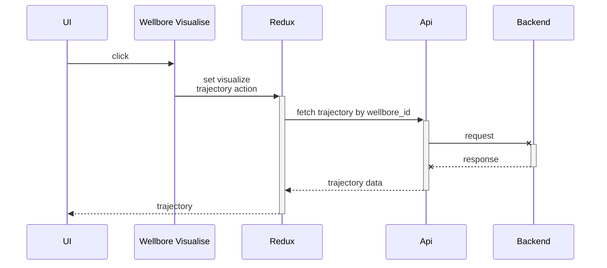
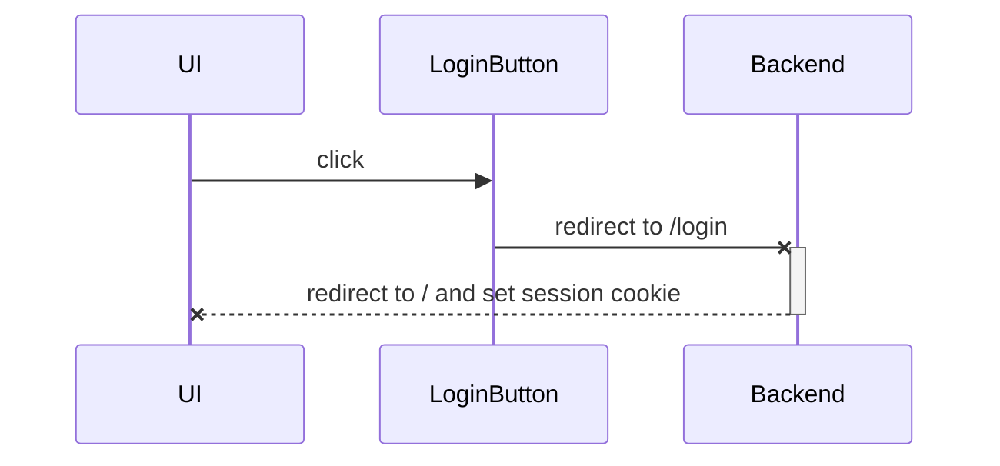

# quickstart

Simple Web App to quickly connect to and try out OSDU APIs

## How to run

Execute the following commands:

install dependencies

```
npm ci
```

run an application

```
npm start
```

### How to change backend host and port

Create `.env` file and define the following variables:

```
SERVER_HOST=backend
SERVER_PORT=8080
```

Note: when using docker-compose to define and run both UI and backend, the value of SERVER_HOST must be the same as the name of service for your backend:

```
services:
  backend:
    ...
  ui:
    ...
    depends_on:
      - backend
```

## Implemented user-interface features

- Searching wells by a name part
- Viewing well's wellbores
- Drawing 3D trajectory of a wellbore

## User stories

### Searching wells by a name part

- Open the main page and take a look at the left top corner to locate pretty obvious search-bar interface
- Type a name of a well (it will be always treated as part of a name, no need for asterisk)
- Press "search", await results, gaze into a fancy spinner
- A list of up to 99 wells will be dispayed right under the search bar
- Or an error, if something goes wrong

### Viewing well's wellbores

- Search for a well
- Click on a name of a well or an "angle"-icon, placed before it, to run a fetch
- A list of wellbrores will be displayed under the well's row in a drop-down style
- Or an error, if something goes wrong

### Drawing 3D trajectory of a wellbore

- Search for a well
- Load its wellbores
- Press the VISUALIZE button, wait for a while
- Enjoy a 3D model of the wellbore trajectory
- If an error occures, button will be changed for an ERROR status and a description could be read in its tooltip
- It is possible to visualize multiple wellbores of a single well in the same 3D model

## Project composition and rationale

### create-react-app

the project is built on top of a create-react-app package as unified method of starting small react projects.

- designed for a purpose to create such small projects
- it is well-known and questions can be googled with ease
- supported by the react community

### typescript

we encourage all web developers to use a good practice - to write typed code

- typescript provides a comprehensive functionality for the subject
- widely used and supported

### css

- the easiest way to write styles
- project is small enough not to encounter harsh consequences
- perfect markup and styling are not the subject of the project

### redux

our application has sufficently complex inner state to use a state manager

- simple and descriptive idea
- fit for the project's small size
- in contrary to mobx redux is known more widely

### thunk

as the application performs an asyncronous communication with an API, interractively responding to user actions, we need to handle side effects of redux-actions

- simple and descriptive idea
- fit for the project's small size
- in contrary to redux-saga thunk is easier to comprehend

### react-router

to build a modern single page application route handler is required

- most popular and well-known router for react

### expressjs

small web server to deliver static files and perform api-requests proxying

- de-facto standart for such purposes at the moment

### jest

we encourage all web developers to use a good practice - to cover a code with test

- delivered with create-react-app
- comprehensive documentation
- easy to use

### enzyme

we use it to enhance react components testing

- HTML snapshots are more descriptive than a virtual DOM structure
- gives an ability to inspect component's children as thoroughly as we need

## external libraries

### three

- used for trajectory 3D model drawing
- well-known JS library for working with 3D

## Sequence diagrams, powered by Mermaid

[Mermaid Manual](https://mermaid-js.github.io/mermaid/#/sequenceDiagram)

### /api/find/wells_by_name



### /api/find/wellbores_by_well_id



### /api/fetch/trajectory_by_wellbore_id



### /login



### /logout


